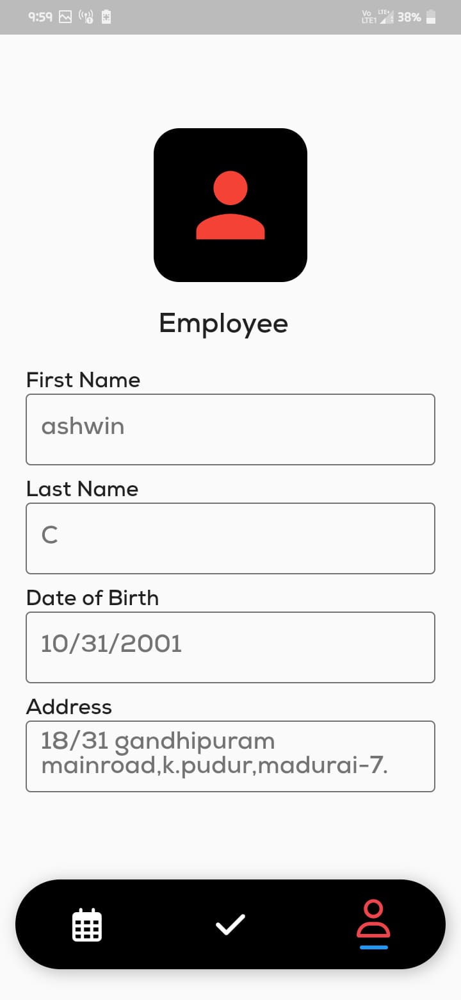

# Smart-Attendance-app
it is a real time application
it was developed for taking employee attendance via smart mobile
in this application when a employee create or register in this application his or her face was scanned
using google MLkit 
and when employee login homepage will appear in that page he can slide the slider and face authentication appear scan the employee face to checkin ;
it means he was arrived at the office.to check whether he is presnt or abscent the manager uses a database in firebase 
where the employee location and the date ,time,and month was added,and there was barcode scanner where it is made for work from home .
when the manager enables work from home the slider wont work,so the employee must scan the barcode which was generated by the manager to register employee attendance;
you must install androidstudio and a emulator or connect your mobile by enabling developer options in developer options pls enable USB debugging.
To run this app ...put flutter pub get dependencies to download the dependencies which will be displayed in android studio "pub get".this will appaer when you open pubspec.yaml file
and run main.dart file to run this application.
to connect firebase you must create a new firebase android project in firebase...

